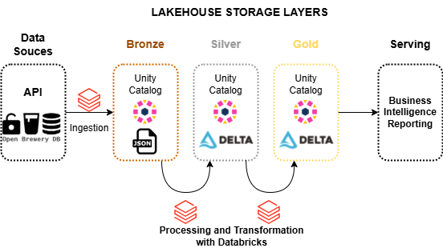
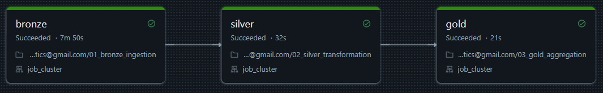

# BEES Data Engineering – Breweries Case

## 📑 Description

This project implements a data pipeline using the **Medallion architecture** (Bronze, Silver, Gold) in **Databricks**, consuming data from the public API [Open Brewery DB](https://www.openbrewerydb.org/).

## 🏗️ Architecture

/Unity Catalog/breweries_analytics/  
├── bronze/breweries.json  
├── silver/breweries_transformed (Delta table partitioned by state)  
└── gold/breweries_aggregated (Delta table view with the count aggregated by type and location)

- **Bronze:** Raw data from the API.
- **Silver:** Cleaned data, partitioned by state (`state`).
- **Gold:** Aggregated data — number of breweries by type and state.

## 🔧 Technologies

- Databricks + Delta Lake  
- PySpark  
- Python (requests, pandas)

## Extract and Load
### Data Sources
All the data were extracted from Open Brewery DB API and stored raw in .json format.

The extraction was triggered daily 6am UTC.

### 🗓️ Orchestration
Databricks was chosen for orchestration, a job containing tasks with data extraction and transformationwas triggered daily 6am UTC.

Centralizing the solution in a single tool that supports all services helps save time and reduce costs.

### 📦 Storage
To store raw data as API JSON File, the project uses Volumes inside the Databricks Unity Catalog.

Some reasons of this choice were:

1. **Data Governance and Security**  
   Storing the JSON file in a Unity Catalog volume ensures centralized access control, fine-grained permissions, and full auditability aligned with enterprise data governance policies.

2. **Centralized Storage**  
   Volumes provide a centralized and organized storage layer within the catalog, making it easier to manage raw data alongside tables and managed datasets.

3. **Separation of Raw and Processed Data**  
   Saving the raw API response as a JSON file preserves the original data for traceability, reproducibility, and audit purposes before any transformation occurs.

4. **Simplified Data Lineage**  
   Keeping the raw file within the same catalog allows for better tracking of data lineage from raw ingestion (bronze) to processed layers (silver and gold).

5. **Standardization Across Pipelines**  
   Using Unity Catalog volumes promotes standardized data handling patterns across different data pipelines, reducing operational complexity.

6. **Cost Efficiency**  
   Avoids the need for external storage systems (like AWS S3, Azure ADLS, or Google GCS) and leverages existing Databricks-managed storage, which can simplify billing and reduce costs.

7. **Ease of Collaboration**  
   Volumes are visible and accessible to authorized users within the workspace and catalog, enhancing team collaboration without complex credential management.

8. **Support for Multiple File Formats**  
   Unity Catalog volumes support storing JSON, CSV, Parquet, images, and other files, making them versatile for storing not only raw data but also intermediate and reference files.

## 🛠️ Transform

Transformations are executed in Databricks using notebooks with python and pyspark scripts running via Jobs just like it is done in extraction.

Some changes were made in the dataframe, such as id column name changes, adding a new column containing the date and time of data ingestion to the Delta table, and filtering by data where the state column is not null.

Finally, an aggregation was performed with the count of the state and type columns.

## ☁️ Cloud Setup

This project was done entirely on the Databricks platform:

Its use and configuration are very simple, which is why it was chosen.

To achieve this, the following steps were taken:

* Creation of a Databricks account using a personal email.

* Creation of a compute cluster that runs Spark natively.

* Creation of a catalog in Unity Catalog.

* Creation of three schemas within the catalog created in the previous step, representing the bronze, silver, and gold layers.

* Creation of three notebooks containing Python and PySpark code for data manipulation and storage.

* Creation of a Job with three tasks responsible for executing the notebooks corresponding to the data that goes into the bronze, silver, and gold layers.

This Job was also configured with a daily execution schedule and an email notification in case any task fails.

## 🔔 Monitoring

Below are some suggestions for implementing a monitoring and alerting process for this pipeline aiming at data quality:

Manual Checks with PySpark (Direct Approach):
* Null values in critical columns.

* Data type validation.

* Duplicate records.

* Values outside valid domains (e.g., invalid states or countries).

* Volume checks (e.g., if zero records are loaded, trigger an alert).

Using Expectations with Delta Live Tables (DLT):
* If using Delta Live Tables (DLT) in Databricks, you can define declarative quality rules.

Monitoring and Logging Quality Checks
* Add logs in Databricks using print() or display().

* Save the results of quality checks into log tables for monitoring.

Alerts and Notifications
* Configure alerts through Databricks Workflows:
  * If a job fails (e.g., due to a failed quality check), it can:
    * Send an email (like it was made).
    * Trigger a webhook to Slack, Teams, PagerDuty, etc.

* Integrate with tools like Datadog, Azure Monitor, AWS CloudWatch for observability.
